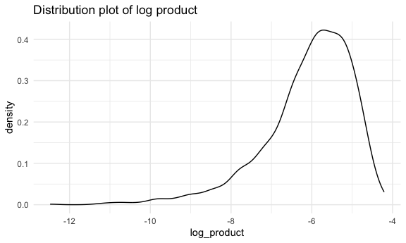
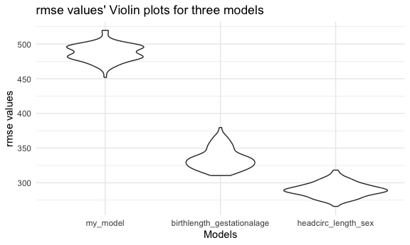

p8105_hw6_lz2949
================
Longyi Zhao
2023-11-25

``` r
library(tidyverse)
```

    ## ── Attaching core tidyverse packages ──────────────────────── tidyverse 2.0.0 ──
    ## ✔ dplyr     1.1.3     ✔ readr     2.1.4
    ## ✔ forcats   1.0.0     ✔ stringr   1.5.0
    ## ✔ ggplot2   3.4.3     ✔ tibble    3.2.1
    ## ✔ lubridate 1.9.2     ✔ tidyr     1.3.0
    ## ✔ purrr     1.0.2     
    ## ── Conflicts ────────────────────────────────────────── tidyverse_conflicts() ──
    ## ✖ dplyr::filter() masks stats::filter()
    ## ✖ dplyr::lag()    masks stats::lag()
    ## ℹ Use the conflicted package (<http://conflicted.r-lib.org/>) to force all conflicts to become errors

``` r
library(modelr)
library(p8105.datasets)
library(mgcv)
```

    ## Loading required package: nlme
    ## 
    ## Attaching package: 'nlme'
    ## 
    ## The following object is masked from 'package:dplyr':
    ## 
    ##     collapse
    ## 
    ## This is mgcv 1.9-0. For overview type 'help("mgcv-package")'.

``` r
knitr::opts_chunk$set(
  fig.width = 6,
  fig.asp = .6, 
  out.width = "90%"
)

theme_set (theme_minimal() +theme(legend.position = "bottom"))

options(
  ggplot2.continuous.colour = "viridis", 
  ggplots.continuous.fill = "viridis"
)

scale_colour_discrete = scale_colour_viridis_d
scale_fill_disrete = scale_fill_viridis_d

set.seed(1)
```

## Problem 1

In the data cleaning code below we create a `city_state` variable,
change `victim_age` to numeric, modifiy victim_race to have categories
white and non-white, with white as the reference category, and create a
`resolution` variable indicating whether the homicide is solved. Lastly,
we filtered out the following cities: Tulsa, AL; Dallas, TX; Phoenix,
AZ; and Kansas City, MO; and we retained only the variables
`city_state`, `resolution`, `victim_age`, `victim_sex`, and
`victim_race`.

``` r
homicide_df = 
  read_csv("data/homicide-data.csv", na = c("", "NA", "Unknown")) |> 
  mutate(
    city_state = str_c(city, state, sep = ", "),
    victim_age = as.numeric(victim_age),
    resolution = case_when(
      disposition == "Closed without arrest" ~ 0,
      disposition == "Open/No arrest"        ~ 0,
      disposition == "Closed by arrest"      ~ 1)
  ) |> 
  filter(victim_race %in% c("White", "Black")) |> 
  filter(!(city_state %in% c("Tulsa, AL", "Dallas, TX", "Phoenix, AZ", "Kansas City, MO"))) |> 
  select(city_state, resolution, victim_age, victim_sex, victim_race)
```

    ## Rows: 52179 Columns: 12
    ## ── Column specification ────────────────────────────────────────────────────────
    ## Delimiter: ","
    ## chr (8): uid, victim_last, victim_first, victim_race, victim_sex, city, stat...
    ## dbl (4): reported_date, victim_age, lat, lon
    ## 
    ## ℹ Use `spec()` to retrieve the full column specification for this data.
    ## ℹ Specify the column types or set `show_col_types = FALSE` to quiet this message.

Next we fit a logistic regression model using only data from Baltimore,
MD. We model `resolved` as the outcome and `victim_age`, `victim_sex`,
and `victim_race` as predictors. We save the output as `baltimore_glm`
so that we can apply `broom::tidy` to this object and obtain the
estimate and confidence interval of the adjusted odds ratio for solving
homicides comparing non-white victims to white victims.

``` r
baltimore_glm = 
  filter(homicide_df, city_state == "Baltimore, MD") |> 
  glm(resolution ~ victim_age + victim_sex + victim_race, family = binomial(), data = _)

baltimore_glm |> 
  broom::tidy() |> 
  mutate(
    OR = exp(estimate), 
    OR_CI_upper = exp(estimate + 1.96 * std.error),
    OR_CI_lower = exp(estimate - 1.96 * std.error)) |> 
  filter(term == "victim_sexMale") |> 
  select(OR, OR_CI_lower, OR_CI_upper) |>
  knitr::kable(digits = 3)
```

|    OR | OR_CI_lower | OR_CI_upper |
|------:|------------:|------------:|
| 0.426 |       0.325 |       0.558 |

Below, by incorporating `nest()`, `map()`, and `unnest()` into the
preceding Baltimore-specific code, we fit a model for each of the
cities, and extract the adjusted odds ratio (and CI) for solving
homicides comparing non-white victims to white victims. We show the
first 5 rows of the resulting dataframe of model results.

``` r
model_results = 
  homicide_df |> 
  nest(data = -city_state) |> 
  mutate(
    models = map(data, \(df) glm(resolution ~ victim_age + victim_sex + victim_race, 
                             family = binomial(), data = df)),
    tidy_models = map(models, broom::tidy)) |> 
  select(-models, -data) |> 
  unnest(cols = tidy_models) |> 
  mutate(
    OR = exp(estimate), 
    OR_CI_upper = exp(estimate + 1.96 * std.error),
    OR_CI_lower = exp(estimate - 1.96 * std.error)) |> 
  filter(term == "victim_sexMale") |> 
  select(city_state, OR, OR_CI_lower, OR_CI_upper)

model_results |>
  slice(1:5) |> 
  knitr::kable(digits = 3)
```

| city_state      |    OR | OR_CI_lower | OR_CI_upper |
|:----------------|------:|------------:|------------:|
| Albuquerque, NM | 1.767 |       0.831 |       3.761 |
| Atlanta, GA     | 1.000 |       0.684 |       1.463 |
| Baltimore, MD   | 0.426 |       0.325 |       0.558 |
| Baton Rouge, LA | 0.381 |       0.209 |       0.695 |
| Birmingham, AL  | 0.870 |       0.574 |       1.318 |

Below we generate a plot of the estimated ORs and CIs for each city,
ordered by magnitude of the OR from smallest to largest. From this plot
we see that most cities have odds ratios that are smaller than 1,
suggesting that crimes with male victims have smaller odds of resolution
compared to crimes with female victims after adjusting for victim age
and race. This disparity is strongest in New yrok. In roughly half of
these cities, confidence intervals are narrow and do not contain 1,
suggesting a significant difference in resolution rates by sex after
adjustment for victim age and race.

``` r
model_results |> 
  mutate(city_state = fct_reorder(city_state, OR)) |> 
  ggplot(aes(x = city_state, y = OR)) + 
  geom_point() + 
  geom_errorbar(aes(ymin = OR_CI_lower, ymax = OR_CI_upper)) + 
  theme(axis.text.x = element_text(angle = 90, hjust = 1))
```


## Problem 2

``` r
# data import 
weather_df = 
  rnoaa::meteo_pull_monitors(
    c("USW00094728"),
    var = c("PRCP", "TMIN", "TMAX"), 
    date_min = "2022-01-01",
    date_max = "2022-12-31") |>
  mutate(
    name = recode(id, USW00094728 = "CentralPark_NY"),
    tmin = tmin / 10,
    tmax = tmax / 10) |>
  select(name, id, everything())
```

    ## using cached file: /Users/longyizhao/Library/Caches/org.R-project.R/R/rnoaa/noaa_ghcnd/USW00094728.dly

    ## date created (size, mb): 2023-09-28 10:19:30.11192 (8.524)

    ## file min/max dates: 1869-01-01 / 2023-09-30

``` r
# fit the regression model 
tmax_fit = weather_df |>
  lm(tmax ~ tmin + prcp, data = _)
```

``` r
# run a bootstrap
tmax_boot = weather_df |> 
  modelr::bootstrap(n = 5000) |> 
  mutate(
    models = map(strap, \(df) lm(tmax ~ tmin + prcp, data = df)),
    results = map(models, broom::tidy),
    glance = map(models, broom::glance)) |>
  select(results, glance) |>
  unnest(results,glance)
```

    ## Warning: `unnest()` has a new interface. See `?unnest` for details.
    ## ℹ Try `df %>% unnest(c(results, glance))`, with `mutate()` if needed.

``` r
r_squared_values = tmax_boot |>
  filter(term == "(Intercept)") |>
  select(r.squared)

log_beta_values = tmax_boot |>
  filter(term == "tmin"| term == "prcp") |>
  select(estimate) 

log_product_value = mutate(log_beta_values, group = rep(1:(n() / 2), each = 2)) |>
  group_by(group) |>
  summarize(log_product = log(prod(estimate)))
```

    ## Warning: There were 3361 warnings in `summarize()`.
    ## The first warning was:
    ## ℹ In argument: `log_product = log(prod(estimate))`.
    ## ℹ In group 2: `group = 2`.
    ## Caused by warning in `log()`:
    ## ! NaNs produced
    ## ℹ Run `dplyr::last_dplyr_warnings()` to see the 3360 remaining warnings.

``` r
# MANY NaN
```

``` r
# confidence interval r^2
r_interval = r_squared_values |>
  summarize(ci_lower = quantile(r.squared, 0.025), 
            ci_upper = quantile(r.squared, 0.975))

cat("The 95% confidence interval for r-square is (", r_interval$ci_lower, ",", r_interval$ci_upper, ")\n")
```

    ## The 95% confidence interval for r-square is ( 0.8885495 , 0.9406812 )

``` r
# confidence interval log(B*B)
log_interval = log_product_value |>
  summarize(ci_lower = quantile(log_product, 0.025, na.rm = TRUE), 
            ci_upper = quantile(log_product, 0.975, na.rm = TRUE))

cat("The 95% confidence interval for log products is (", log_interval$ci_lower, ",", log_interval$ci_upper, ")\n")
```

    ## The 95% confidence interval for log products is ( -8.981559 , -4.601673 )

``` r
# plot the distribution of estimates
estimated_data = cbind(r_squared_values, log_product_value) 

ggplot(estimated_data, aes(x = r.squared)) +
  geom_density() + 
  labs(title = "Distribution plot of r.squared")
```


Interpretation: r-squared typically ranges from 0 to 1, where 0
indicates the model does not explain any of the variance, and 1
indicates the model explains all of the variance. The plotted r squared
distribution is close to normal, centered around 0.92, showing the model
fits the data in a pretty good way.

``` r
ggplot(estimated_data, aes(x = log_product)) +geom_density() +
  labs(title = "Distribution plot of log product")
```

    ## Warning: Removed 3361 rows containing non-finite values (`stat_density()`).



``` r
# report how many NaN in the dataset
```

Interpretation: Lots of Beta2 are negative values, leading to
log(negative numbers) which does not exist in real number space. Among
5000 log products, 3361 of them are NaN. Which counts for 67.22 percent
of 5000 data points. The distribution plot of log products is clearly
not normally distributed, it is left-skewed and has a heavy tail
extending to low values, values around -6 has the highest density.
Features like that may be related to the frequency with with large
outliers are included in the bootstrap sample.

## Problem 3

Analyze data gathered to understand the effects of several variables on
a child’s birthweight.

``` r
# import data
bwt_df = read_csv("./data/birthweight.csv") |>
  janitor::clean_names() |>
  drop_na() |>
  mutate( 
    babysex = factor(
      babysex, levels = c("1","2"),labels = c("male", "female")), 
    frace = factor(frace, levels = c("1","2","3","4","8","9"), labels = c("White", "Black", "Asian", "Puerto Rican", "Other", "Unknown")), 
    mrace = factor(mrace, levels = c("1","2","3","4","8"), labels = c("White", "Black", "Asian", "Puerto Rican", "Other")), 
    malform = factor(malform, levels = c("0","1"), labels = c("absent", "present")))
```

    ## Rows: 4342 Columns: 20
    ## ── Column specification ────────────────────────────────────────────────────────
    ## Delimiter: ","
    ## dbl (20): babysex, bhead, blength, bwt, delwt, fincome, frace, gaweeks, malf...
    ## 
    ## ℹ Use `spec()` to retrieve the full column specification for this data.
    ## ℹ Specify the column types or set `show_col_types = FALSE` to quiet this message.

``` r
# drop NA
# convert sex/frace/mrace/malform to factor
```

Propose a regression model for birthweight. use add_predictions and
add_residuals in making plots.

``` r
bwt_df |>
  ggplot(aes(x = wtgain, y = bwt)) +
  geom_point() +
  geom_smooth(method = "lm", se = FALSE) +
  ylab("Birth weight of baby (grams)") +
  xlab("Mother's weight gain during pregnancy (pounds)")+
  labs(title = "plot of mother's weight gains vs. baby birth weight")
```

    ## `geom_smooth()` using formula = 'y ~ x'


``` r
bwt_df |>
  ggplot(aes(x = mheight, y = bwt)) +
  geom_point() +
  geom_smooth(method = "lm", se = FALSE) +
  ylab("Birth weight of baby (grams)") +
  xlab("Mother's height (inches)")+
  labs(title = "plot of mothers' height vs. baby birth weight")
```

    ## `geom_smooth()` using formula = 'y ~ x'


``` r
# linear model 
prop_lm = lm(bwt ~ wtgain + mheight, data = bwt_df)


bwt_df |>
  modelr::add_residuals(prop_lm) |>
  modelr::add_predictions(prop_lm) |>
  ggplot(aes(x = pred, y = resid)) + geom_point() +
  ylab("Residual") +xlab("Fitted values") +labs(title = "plot of residual against fitted values")
```


Description: Ideas that mothers who experience a more substantial weight
gain during pregnancy are likely to deliver babies with higher birth
weights and higher mothers probably have greater capacities of bearing
bigger babies in them immediately come to my mind. I first plot the baby
birthweight vs. mother’s weight gain during pregnancy and fit a line to
see the trend, the line has a positive slope, indicating that there
might be a positive correlation between mother’s weight gain and birth
weight of baby. Then I did similar stuff to the mother’s height. Finally
I build the slr using mothers’ weight gain and mothers’ height as
predictors. <br> From the residual plot, it can be found that most
points are gathered around 0 with no obvious trend or distribution.

``` r
# using length at birth and gestational age as predictor
lbga_mod = lm(bwt ~ blength + gaweeks, data = bwt_df)
# use head circumference, length, sex, and all interactions between these
hcls_mod = lm(bwt ~ bhead + blength + babysex + bhead * blength * babysex, data = bwt_df)
```

``` r
# comparison in terms of cross-validated prediction error; use corssv_mc and functions in purrr. 
b_df =
  crossv_mc(bwt_df, 100) |> 
  mutate(
    train = map(train, as_tibble),
    test = map(test, as_tibble))

# use mutate +map and map 2 to fit models
b_df = 
  b_df |> 
  mutate(
    prop_lm  = map(train, \(df) lm(bwt ~ wtgain + mheight, data = df)),
    lbga_mod = map(train, \(df) lm(bwt ~ blength + gaweeks, data = df)),
    hcls_mod = map(train, \(df) lm(bwt ~ bhead + blength + babysex + bhead * blength * babysex, data = df))) |> 
  mutate(
    rmse_my_model = map2_dbl(prop_lm, test, \(mod, df) rmse(model = mod, data = df)),
    rmse_birthlength_gestationalage = map2_dbl(lbga_mod, test, \(mod, df) rmse(model = mod, data = df)),
    rmse_headcirc_length_sex = map2_dbl(hcls_mod, test, \(mod, df) rmse(model = mod, data = df)))
```

``` r
# plot the preiction error 
b_df |> 
  select(starts_with("rmse")) |> 
  pivot_longer(
    everything(),
    names_to = "model", 
    values_to = "rmse",
    names_prefix = "rmse_") |> 
  mutate(model = fct_inorder(model)) |> 
  ggplot(aes(x = model, y = rmse)) + geom_violin() +
  xlab("Models") + ylab("rmse values") +labs(title = "rmse values' Violin plots for three models")
```



Interpretation: RMSE is a measure of the average deviation between the
observed values and predicted values by the regression model. A lower
RMSE indicates a better fit of the model to the data. From the violin
plot, it can be see that the second and third models are better than the
first one, they have lower RMSE values, indicating they have smaller
prediction error. This is probably because the first model use mothers’
characteristics as the predictor which does not directly impact baby’s
birth weight; the second and third use babies’ characteristics as
predictors when building the model which have a more direct correlation
and can explain more variances of the outcome and thus fit data in a
better way.
